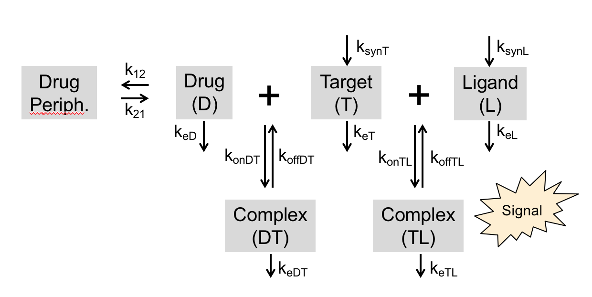
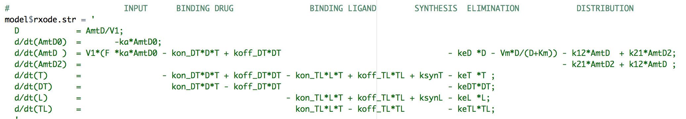
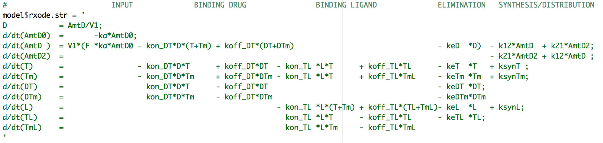

```{r, warning=FALSE}
# This code may be needed if run on Windows
Sys.setenv(PATH = paste(Sys.getenv("PATH"), "C:/RBuildTools/3.4/bin/", "C:/RBuildTools/3.4/mingw_64/bin", sep = ";"))
Sys.setenv(BINPREF = "C:/RBuildTools/3.4/mingw_64/bin/")

# To be called at the top of every Rmd file. Initialization code and some useful constants.
suppressMessages(source("ams_initialize_script_v3.R"))
```

#The model of a drug, target, and endogenous ligand - Model G (DTL)
Consider the model below where a drug ($D$) binds its target ($T$) to form a complex ($DT$) and the target also binds an endogenous ligand ($L$) to form a signaling complex ($TL$).  This is the case where a target ($T$) binds two different ligands and it has been considered in the following references, albeit with different notation.

* Peletier, Lambertus A., and Johan Gabrielsson. "New Equilibrium Models of Drug-Receptor Interactions Derived from Target-Mediated Drug Disposition." The AAPS journal 20.4 (2018): 69.

* Motulsky, Harvey J., and L. C. Mahan. "The kinetics of competitive radioligand binding predicted by the law of mass action." Molecular pharmacology 25.1 (1984): 1-9.


The equations for the model are:


The model parameters used for some initial simulations, based loosely on Tocilizumab (drug), soluble IL-6R (target) and IL-6 (ligand) kinetics.  The parameters are provided below.

```{r, warning=FALSE}
# Load model and parameters.
source("ivsc_2cmt_DTL.R")
model           = ivsc_2cmt_DTL()
drugs           = "Tocilizumab"
filename        = paste0("../data/ModelG_", drugs,"_Params.xlsx")
param = read.param.file(filename)
df_param        = as.data.frame(t(param))

d = read_excel(filename) %>%
  select(-Order) %>%
  mutate(Value = signif(Value,2))
kable(d)

#Set dosing parameters
dose.nmol       = scale.mpk2nmol #1 mg/kg (mpk)
tmax            = 26*7 #days (maximum time point)
tau             = 42   #days between doses
compartment     = 2    #compartment drug is dosed into

#set sampling and dosing event (ev) table
ev = eventTable(amount.units="nmol", time.units="days")
sample.points = c(seq(-7, tmax, 0.1), 10^(-3:0)) # sample time, increment by 0.1
sample.points = sort(sample.points)
sample.points = unique(sample.points)
ev$add.sampling(sample.points)
ev$add.dosing(dose            = dose.nmol, 
              nbr.doses       = floor(tmax/tau)+1, 
              dosing.interval = tau,
              dosing.to       = compartment)

#set the initial condition
init = model$init(param)
    
#run the model
out  = model$rxode$solve(param, ev, init)
out  = model$rxout(out)

#modify output dataframe for plotting
out.plot = out %>%
  select(-Ttot,-Ltot) %>%
  gather(cmt,value,-c(time))
  
#plot the results
  g = ggplot(out.plot,aes(x=time,y=value,group=cmt,color=cmt))
  g = g + geom_line()
  g = g + scale.y.log10()
  g = g + scale_x_units(units.input = "day",units.output = "month",increment = 1,t.end = tmax/30)
  print(g)
  
```

#Simulation of a single dose, overlaying data from Tocilizumab - Model G (DTL)

Below, data is taken from the following reference

* Jean-Eric Charoin, Micha Levi, Nicolas Frey, Isabelle Delor, and Philippe Jacqmin. Target mediated drug disposition (tmdd) in rheumatoid arthritis, a case study using tocilizumab. Presenetd at the 6th International Symposium on Measurement and Kinetics of in Vivo Drug Effects in Noordwijkerhout, The Netherlands, 2010.

The parameters used are in the table above.

```{r, warning=FALSE, message=FALSE}
d = read_csv("../data/Charoin10_RA_1pt/Task01_Charoin10_Data_1pat.csv") %>%
  filter(VALNAME != "CRP") %>%
  arrange(-VALUE) %>%
  mutate(VALNAME = factor(VALNAME,levels=unique(VALNAME)))

g = ggplot(data=d,aes(x=TIME,y=VALUE,color=VALNAME,shape=VALNAME))
g = g + geom_point()
#g = g + geom_line()
g = g + scale.y.log10()
g = g + scale_x_units(t.end = max(d$TIME))
g = g + labs(y="Concentration (nM)",
             color = "Measurement",
             shape = "Measurement")
g = g + ggtitle("Charoin10 Data from 1 patient")
gdata = g

#set up dosing
ev = eventTable(amount.units="nmol", time.units="days")
ev$add.sampling(seq(-7,70,by = .1))
ev$add.dosing(dose            = 8*scale.mpk2nmol, 
              nbr.doses       = 1,
              start.time      = 7,
              dosing.to       = compartment) 

#tweak param
param["ksynL"] =.008
param["keL"] =  1
param["keTL"] = 200

#set initial condition
init = model$init(param)
    
#run the model
out  = model$rxode$solve(param, ev, init)
out  = model$rxout(out) %>%
  select(TIME=time,
         Tocilizumab = D,
         sIL6R = Ttot,
         IL6 = L) %>%
  gather(VALNAME,VALUE,-TIME) %>%
  mutate(VALUE = ifelse(VALUE==0,NA,VALUE))

  g = gdata + geom_line(data=out)
  g = g + scale_x_units(t.end = max(out$TIME))
  print(g)
  ggsave("../results/Task04_Toci_Sim_Data.png",width=4,height=4)
```

#Trying a second model with membrane-bound target (mIL6R) - Model H (DT2L)
This fit was a little bit better, though I'm still not entirely confident in the realism of the parameter selection, where keL (elimination half-life of IL-6) is only 10/day.  

The model below is simulated with a membrane-bound target as well

The equations for the model are:


```{r, warning=FALSE, message=FALSE}
model           = ivsc_2cmt_DT2L()
drugs           = "Tocilizumab"
filename        = paste0("../data/ModelH_", drugs,"_Params.xlsx")
param = read.param.file(filename)
d.param        = as.data.frame(t(param))

d = read_excel(filename) %>%
  select(-Order) %>%
  mutate(Value = signif(Value,2))
kable(d)

init = model$init(param)
    
out  = model$rxode$solve(param, ev, init)
out  = model$rxout(out) %>%
  select(TIME=time,
         Tocilizumab = D,
         sIL6R = Ttot,
         IL6 = L) %>%
  gather(VALNAME,VALUE,-TIME) %>%
  mutate(VALUE = ifelse(VALUE<1e-6,NA,VALUE))

  g = gdata + geom_line(data=out)
  g = g + scale_x_units(t.end = max(out$TIME))
  print(g)
  ggsave("../results/Task04_Toci_Sim_Data_Tm.png",width=4,height=4)

```


  


